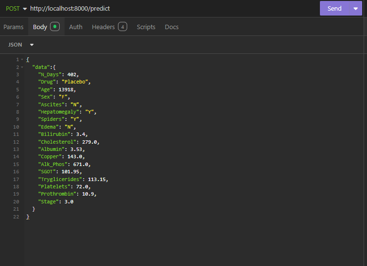

# Estructura

El codigo donde se trabajo el modelo inicial, sin refactorizar se encuentra en el archivo llamado cirrhosis.ipynb ubicado en la carpeta de notebooks.
Una vez refactorizado se debe crear el notebook refactorizado con otro nombre en la carpeta de notebooks y las classes en scripts de python y el codigo main se debe de guardar en la carpeta refactoring.
En la carpeta de data se van a guardar todos los archivos de datos, para poder llevar el control de sus versiones.
En la carpeta de models se van a guardar todos los modelos, para poder llevar el control de sus versiones
Se agrego la carpeta remote_storage, que contiene todos los archivos de dvc en su format de almacenamiento, para que puedan jalar los archivos sin ningun problema.

# Instrucciones de uso

El jupyter notebook se puede ejecutar de principio a fin una vez que se hayan instalado todas las librerias con el comando pip install -r requirments.txt.
para jalar los archivos de dvc simplemente hay que ejecutar el comando dv pull, eso deberia generar todos los archivos en local sin ningun problema dentro de la carpeta models y data.
Cuando se agregue un nuevo archivo de datos o se modifique uno existente hay que ejecutar el comando dvc ,/ add data y posteriormente el comando dvc push.
Cuando se agregue un nuevo archivo de modelo o se modifique uno existente hay que ejecutar el comando dvc ,/ add models y posteriormente el comando dvc push.
Para bajar todos los archivos de dvc hay que ejcutar el comando dvc pull (Avisarme si no funciona)

para ejecutar los archivos de python, se creo un pipeline de dvc, el cual nos ayudara a guardar la version de los datos y modelos usados en cada iterracion, de igual manera este nos ayudara a poder tener un proceso repetible, para ayudar al continues deployment.

Para ejecutar el pipeline de dvc se ejecuta el siguiente comando desde el directorio raiz.

dvc exp run

------------

Start MFlow

Start services `docker-compose --env-file config.env up -d --build`

Go to `localhost:9001`

Get MINIO Acces Key and save into `config.env/MINIO_ACCESS_KEY`

Stop services `docker-compose down`

Start again `docker-compose --env-file config.env up -d --build`

______________________________________________

`docker-compose -f --env-file config.env up -d --build`

--------------------------------------------

Para replicar un ejemploo hay que hacer los siguientes pasos.

git checkout <ID_Commit> Debe ser el commit ID de la prueba que queremos replicar, sino la rama de la prueba que queremos replicar
ejecutar el comando python .\reevaluate.pyaluate.py "<RUN_name>" El nombre de la corrida que queremos replicar, el nombre se seta en  los parametros, en cada nueva corrida no olvidar de actualizar este parametro y también hacer el commit despues del dvc push con el nombre de la corrida o lsa rama que se llame igual de la corrida para poder replicar sin problemas

---------------------------------------------

Para ejecutar las pruebas el siguiente commando se debe de ejecutar

pytest -s -W ignore 

Las puruebas codificadas por ahora son 
test de datos de entrada
test de preprocesamiento
test de calidad del modelo

Las pruebas funcionan a partir del commit de unittest
De igual manera a partir del commit de Run 5 fase 3 se agrego el unit testing al pipeline de devc, por lo que al ejecutar dvc repro, se ejecuta el testing una vez que se contruye el modelo.

------------------------------------------------

To Deploy you will need to have the .env file in the Deploy folder, the simply execute the application with the following command:

This will download the desired model from MLFlow and execute the server to host the api, this works locally, no need to add something else. Make sure you have mlflow with at least 1 run.

The env file for local environmment should have the following info

MLFLOW_URL=http://localhost:5000
MLFLOW_EXP_NAME="Cirrhosis V1"
MLFLOW_RUN_NAME=<Name of the Run> Exaple: "Run 4 fase 3"

MODEL_PATH=<End section of the path of the model in mlflow> Exaple: LogRegresion_model

-------------------------------------------------

To Deploy as a docker container First we need to build the image.
Run the following commando from a terminal started in the root of the folder:

docker build ./Deploy -t model_cirrhosis:latest

Once the container image is built execute the following command to start the container:

docker run --env-file ./Deploy/.env -p 8000:8000  model_cirrhosis

The env file for docker environmment in Windows should have the following info

MLFLOW_URL=http://host.docker.internal:5000
MLFLOW_EXP_NAME="Cirrhosis V1"
MLFLOW_RUN_NAME=<Name of the Run> Exaple: "Run 4 fase 3"

MODEL_PATH=<End section of the path of the model in mlflow> Exaple: LogRegresion_model

-------------------------------------------------

The following request needs to be performed to get a prediction, this is the same, if the application started in docker or localeith python commnad
the request can be done by any request software like Insomnia or postman or trough curl

curl --request POST \
  --url http://localhost:8000/predict \
  --header 'Content-Type: application/json' \
  --header 'User-Agent: insomnia/9.3.3' \
  --data '{
	"data":{
		"N_Days": 402,
    "Drug": "Placebo",
    "Age": 13918,
    "Sex": "F",
    "Ascites": "N",
    "Hepatomegaly": "Y",
    "Spiders": "Y",
    "Edema": "N",
    "Bilirubin": 3.4,
    "Cholesterol": 279.0,
    "Albumin": 3.53,
    "Copper": 143.0,
    "Alk_Phos": 671.0,
    "SGOT": 101.95,
    "Tryglicerides": 113.15,
    "Platelets": 72.0,
    "Prothrombin": 10.9,
    "Stage": 3.0
	}
}'

Of course the data can be changed , this is the example I used.

